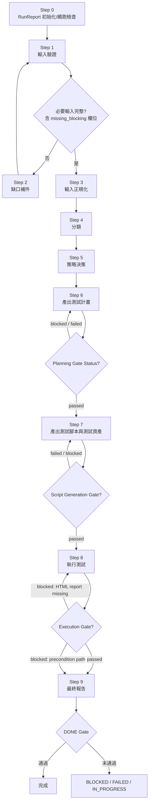
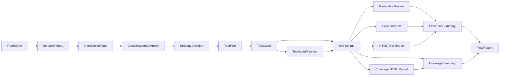

# autoFEUnitTest-workflow 使用說明

## 用途

`autoFEUnitTest-workflow` 是一套前端單元測試治理型 workflow，適用於：

- `React`
- `Vue`
- `HTML + JS`
- `HTML + JS + jQuery`

此 skill 的目的不是只生成測試碼，而是用標準流程完成：

1. 輸入檢核
2. 缺口補件
3. 技術棧與風險分類
4. 測試策略決策
5. 測試計畫與案例產出
6. 測試腳本與測試資產產出
7. 執行測試與保留證據
8. 產出最終報告

## 適用情境

適合：

1. 想對既有前端模組補單元測試
2. 想對元件、DOM 邏輯、事件互動建立標準化測試流程
3. 想要有 `RunReport`、Gate、證據鏈與續跑能力
4. 想把測試產出整理成可追溯的文件與模板

不適合：

1. 純 `E2E` 測試
2. 跨頁流程或登入治理
3. 以正式站台驗證為主的測試工作

## 發布邊界

這套 skill 對外發布時，應明確理解以下邊界：

1. 這是 `frontend unit/component test workflow`
2. 這不是 `E2E workflow`
3. 這不是正式站台驗證或登入治理流程
4. 這不是視覺回歸測試框架
5. 此 skill 強調 `RunReport`、Gate、證據鏈、續跑與治理完整度

更多限制請參考：

- [KNOWN-LIMITATIONS.md](KNOWN-LIMITATIONS.md)

## 用法

### 建議叫用方式

```text
/auto-fe-unit-test-workflow src/components/Button.tsx
```

或：

```text
/auto-fe-unit-test-workflow src/legacy/order-form.js
```

也可以附加目標描述：

```text
/auto-fe-unit-test-workflow src/components/LoginForm.tsx
目標是補齊表單驗證、錯誤提示與 API mock 的單元測試。
```

更多範例可參考：

- [examples/invocation-examples.md](examples/invocation-examples.md)

## Quick Start

1. 準備最小必要輸入
- `source_code`（Required）
- `project_config`（Required）
- `test_targets`（Required）
- `behavior_spec`（Required）
- `framework_type`（Governed Required：可由 `source_code` / `project_config` 推導；若無可信推導來源，Step 1 將標記為 `missing_blocking` 並觸發 Step 2 補件）
- `acceptance_rules`（Governed Required：可由 `behavior_spec` / `known_risks` 推導；若無可信推導來源，Step 1 將標記為 `missing_blocking` 並觸發 Step 2 補件）
- `test_env`（Governed Required / auto-repairable：由 Step 1 自動偵測與初始化；即使其他 Required 輸入缺失，也不得延後；僅在自動初始化失敗時標記為 `missing_blocking`）

2. 使用 skill 指向目標檔案或目錄

```text
/auto-fe-unit-test-workflow src/components/LoginForm.tsx
```

3. 讓 workflow 先完成 `RunReport` 初始化、輸入驗證與 `test_env` 自動初始化嘗試

4. 若缺資料，先補齊再繼續，不要跳過 `BLOCKED` 狀態；Step 2 只處理需要使用者提供的缺口，完成後必須回到 Step 1 重跑輸入驗證
5. 若阻塞原因是 `test_env`，代表 Step 1 已經嘗試自動初始化但失敗；依 `TROUBLESHOOTING.md` Section 12 修復環境後，再回到 Step 1 重跑

6. 確認最終已產出：
- `RunReport.md`
- `InputSummary.md`
- `NormalizedInput.md`
- `ClassificationSummary.md`
- `StrategyDecision.md`
- `TestPlan.md`
- `TestCases.md`
- `TestAssetManifest.md`
- `GenerationReview.md`
- `ExecutionRaw.log`（若 Step 8 前置條件不成立，在 `RunReport.md` 中將 `Execution Raw Status` 標記為 `not_applicable`，此檔案通常不產出）
- `test-report-html/index.html`（若 Step 8 前置條件不成立，在 `RunReport.md` 中將 `Test Result HTML Report Status` 標記為 `not_applicable`，此檔案通常不產出）
- `coverage-html/index.html`（若 Step 8 前置條件不成立，在 `RunReport.md` 中將 `Coverage HTML Report Status` 標記為 `not_applicable`，此檔案通常不產出）
- `ExecutionSummary.md`
- `CoverageSummary.md`
- `FinalReport.md`

## 流程摘要

此 skill 依序執行 `Step 0 ~ Step 9`：

1. Step 0: `RunReport` 初始化/續跑檢查
2. Step 1: 輸入驗證
3. Step 2: 缺口補件
4. Step 3: 輸入正規化
5. Step 4: 技術與測試目標分類
6. Step 5: 測試策略決策
7. Step 6: 產出測試計畫
8. Step 7: 產出測試腳本與測試資產
9. Step 8: 執行測試
10. Step 9: 最終報告與 DONE Gate

補充：若 Step 1 發現 blocker，Step 2 補件完成後必須先回到 Step 1 重跑輸入驗證，再進入 Step 3。

補充：Step 2 補件完成後，必須回到 Step 1 重跑輸入驗證，不得直接跳到 Step 3。

補充：`test_env` 屬於 Step 1 的自動修復型輸入。即使 `project_config`、`test_targets` 或 `behavior_spec` 仍缺失，Step 1 也必須先完成 runner 偵測與自動初始化嘗試；Step 2 不得把 `test_env` 當作一般一問一答補件欄位。

補充：流程結束後，應先用中文向使用者總結本次結果；只有在 `test-report-html/index.html` 或 `coverage-html/index.html` 已合法產出時，才主動詢問是否要用網頁檢視測試結果。若流程為 `BLOCKED`，或 HTML 報告不存在 / `not_applicable`，則不主動詢問。

### Mermaid 流程圖



## 主要檔案說明

### 核心文件

1. `SKILL.md`
skill 入口、導航與流程摘要。

2. `governance.md`
定義狀態機、Gate、證據規則與禁止反模式。

3. `project-profile-auto-fe-unit.md`
定義預設輸出路徑與技術預設。

### 流程文件

位於 `workflow/`：

- `step-0-runreport.md`
- `step-1-input-gate.md`
- `step-2-gap-check.md`
- `step-3-normalize.md`
- `step-4-classify.md`
- `step-5-strategy.md`
- `step-6-generate-plan.md`
- `step-7-generate-script.md`
- `step-8-run.md`
- `step-9-report.md`

### 參考文件

位於 `references/`：

- `input-schema.md`
- `classification-rules.md`
- `evidence-contract.md`
- `strategy-matrix.md`
- `output-contract.md`
- `architecture.md`

### 模板文件

位於 `templates/`，用來產生標準交付物，例如：

- `RunReport.template.md`
- `InputSummary.template.md`
- `TestPlan.template.md`
- `GenerationReview.template.md`
- `ExecutionSummary.template.md`
- `FinalReport.template.md`

條件式模板包含：

- `MockStrategy.template.md`
- `GapReport.template.md`
- `EnvTemplate.example`：當測試需要環境變數範例時使用，與 `test_env` 是否缺失無直接對應

`MockStrategy.md` 的建議觸發條件：

1. 兩個以上外部 API / network dependency 需要 mock
2. 存在第三方 SDK、plugin 或 analytics side effect
3. 需要 mock 兩個以上 browser APIs，例如 `localStorage`、`location`、`ResizeObserver`
4. `test_env` 會影響測試行為或 mock 連線目標
5. 需要 partial mock，且 mock 邊界不只單一函式或單一模組

`GapReport.md` 的建議觸發條件：

1. Step 2 補件後仍有 `missing_blocking`
2. 缺口已阻塞 Step 3 之後的流程
3. 需要使用者或後續回合才能解除 blocker

### 範例文件

位於 `examples/`，用來參考不同技術棧的預期輸出。

條件式產物範例可參考：

- `examples/output-example-mock-strategy.md`
- `examples/output-example-gap-report.md`

## 主要產出

完整版 workflow 主要產出包含：

1. `RunReport.md`
2. `InputSummary.md`
3. `NormalizedInput.md`
4. `ClassificationSummary.md`
5. `StrategyDecision.md`
6. `TestPlan.md`
7. `TestCases.md`
8. `TestAssetManifest.md`
9. `GenerationReview.md`
10. `ExecutionRaw.log`（若 Step 8 前置條件不成立，在 `RunReport.md` 中將 `Execution Raw Status` 標記為 `not_applicable`，此檔案通常不產出）
11. `test-report-html/index.html`（若 Step 8 前置條件不成立，在 `RunReport.md` 中將 `Test Result HTML Report Status` 標記為 `not_applicable`，此檔案通常不產出）
12. `coverage-html/index.html`（若 Step 8 前置條件不成立，在 `RunReport.md` 中將 `Coverage HTML Report Status` 標記為 `not_applicable`，此檔案通常不產出）
13. `ExecutionSummary.md`
14. `CoverageSummary.md`
15. `FinalReport.md`

### 產出物關聯圖



## 注意事項

1. 這是一套治理型 workflow，不是單一步驟的測試產生器。
2. 缺少必要資訊時，流程應停在 `BLOCKED`，不能硬做假設。
3. 所有重要結論都需要證據支撐，沒有證據不得視為完成。
4. `RunReport.md` 是續跑與治理核心，不應省略。
5. 若專案已有既有測試工具，策略上應優先考慮沿用。
6. 若專案依賴 env、API、SDK、storage、plugin，應在策略與 mock 規劃中明確記錄。
7. 此 skill 聚焦單元測試與元件/DOM 測試，不應直接擴張成 `E2E` workflow。
8. `framework_type` 必須在 Step 4 完成時被明確確認（`Classification Status = passed`），`acceptance_rules` 必須在 Step 5 完成時被明確確認（`Strategy Gate Status = passed`）。

## 驗證

可使用以下腳本檢查技能包完整性（須在 `autoFEUnitTest-workflow/` 根目錄下執行）：

```text
node scripts/verify-skill-bundle.mjs
node scripts/verify-workflow-skill.mjs
node scripts/verify-output-contract.mjs
node scripts/verify-doc-consistency.mjs
node scripts/verify-all.mjs
```

> 以上腳本為 skill 開發與維護用途，不屬於 workflow 執行的必要步驟。

發布前檢查請參考：

- [RELEASE-CHECKLIST.md](RELEASE-CHECKLIST.md)

## 常見阻塞

如果流程停在 `BLOCKED`，常見原因包含：

1. 缺少 `behavior_spec`
2. 缺少可用的 `test_targets`
3. 外部依賴契約不明，無法安全建立 mock
4. legacy plugin / SDK 行為不明
5. 原始執行證據無法正規化到 `ExecutionRaw.log`

詳細處理方式請參考：

- [TROUBLESHOOTING.md](TROUBLESHOOTING.md)

## 建議閱讀順序

1. `README.md`
2. `SKILL.md`
3. `governance.md`
4. `references/input-schema.md`
5. `references/strategy-matrix.md`
6. `workflow/step-0-runreport.md` 到 `workflow/step-9-report.md`
