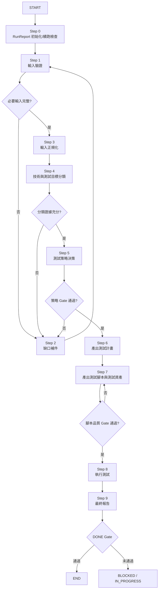
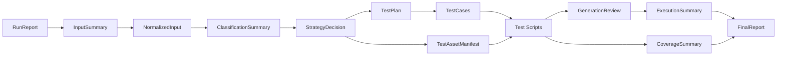

# autoFEUnitTest-workflow 規劃文件

## 1. 目標定位

`autoFEUnitTest-workflow` 的目標是提供一套可重複、可攜、可治理的前端單元測試工作流，適用於以下技術情境：

- `React`
- `Vue`
- `HTML + JavaScript`
- `HTML + JavaScript + jQuery`

此工作流聚焦於：

- 純邏輯 `Unit Test`
- 元件/DOM 層 `Component/DOM Test`
- 測試計畫、測試腳本、執行結果與報告的標準化產出

此工作流範圍不包含 `E2E`、跨頁流程、登入流程、正式環境驗證

## 2. 核心設計原則

1. 先補齊輸入，再產出腳本，避免盲目生成測試。
2. 先分類與策略決策，再選擇工具與測試環境。
3. 讓 `React`、`Vue`、`HTML+JS`、`jQuery` 共用同一套治理流程，但保留分類分支。
4. 預設優先支援 `Unit Test + Component/DOM Test`，不把 `E2E` 耦合進主流程。
5. 正式機密不是必要輸入，測試應優先使用 `mock env`、`stub`、`fixture`。
6. 每一步都要有可追蹤產出，便於續跑、審核與維護。
7. 所有結論必須有明確證據，沒有證據不得視為成立。
8. 缺少必要資訊時流程應停在 `BLOCKED`，不得跳步假設。

## 3. 適用範圍與非範圍

### 適用範圍

- 函式、工具模組、格式轉換、商業邏輯
- UI 元件渲染
- DOM 操作
- 事件互動
- 表單驗證
- 非同步前端行為
- API 呼叫前的資料處理與錯誤處理

### 非範圍

- 正式站台壓測
- 大型整合測試治理
- 真實帳號登入與跨系統驗證
- 視覺回歸測試
- 完整瀏覽器相容性矩陣驗證

## 4. 工作流總覽

建議主流程：

`START -> Step 0 RunReport 初始化/續跑檢查 -> Step 1 輸入驗證 -> Step 2 缺口補件 -> Step 3 輸入正規化 -> Step 4 分類 -> Step 5 策略決策 -> Step 6 產出測試計畫 -> Step 7 產出測試腳本 -> Step 8 執行測試 -> Step 9 最終報告 -> DONE Gate`

### Repo 目錄原則

1. `autoFEUnitTest-workflow/plan/` 只放規劃、設計、討論用文件。
2. `autoFEUnitTest-workflow/skills/` 放正式 skill 執行資產。
3. 所有可被 workflow 直接引用的主流程、參考檔、模板、範例、腳本都歸類到 `skills/`。

### Mermaid 流程圖



## 5. 治理模型

### 5.1 狀態機

- `NEW`
- `IN_PROGRESS`
- `BLOCKED`
- `DONE`
- `FAILED`

### 5.2 Gate 原則

1. 每一步都必須有 `entry gate` 與 `exit evidence`。
2. 前一步未完成或證據不足，下一步不得啟動。
3. 缺少必要輸入時，流程狀態應標記為 `BLOCKED`，不能強行往下。
4. 產物完成不代表步驟完成，必須通過對應檢核。
5. `DONE` 只能在必要產物齊全且證據鏈完整時成立。

### 5.3 證據契約

1. 每個分類結果都要有來源依據，例如檔案、設定、程式結構、既有測試配置。
2. 每個策略決策都要說明採用原因與未採用原因。
3. 每個測試案例都要能追溯到 `behavior_spec`、bug、元件職責或風險來源。
4. 每個執行結果都要保留原始測試輸出、coverage 摘要或等價執行證據。
5. 沒有證據的結論只能列為假設，不得列為完成結果。

### 5.4 RunReport 驅動原則

整個 workflow 由 `RunReport.md` 驅動，用來管理：

- 當前狀態
- 目前步驟
- 已驗證輸入
- 阻塞問題
- 產物路徑
- Gate 檢核結果
- 證據完整性

### 5.5 續跑規則

1. 每次啟動 workflow，先檢查是否存在既有 `RunReport.md`。
2. 若存在，從最後一個合法且未完成的 step 續跑。
3. 若證據缺失或產物不一致，流程應回退到最近可重新建立證據的步驟。
4. 不允許跳過中間 gate 直接執行後續步驟。

### 5.6 RunReport 最小欄位

`RunReport.template.md` 建議至少包含以下區塊：

1. 中繼資料
說明：`Status`、`Current Step`、`Last Updated`、`Workflow Mode`。

2. 輸入
說明：`Source Code Path`、`Project Config Path`、`Framework Type`、`Test Targets`、`Behavior Spec Source`、`Node Version`、`Package Manager`。

3. 驗證
說明：`Input Validation Status`、`Missing Required Inputs`、`Classification Status`、`Strategy Gate Status`、`Script Generation Gate`、`Execution Gate`。

4. 證據中繼資料
說明：`App Version / Commit`、`Test Data Identifier(s)`、`Coverage Evidence`、`Verification DoD Status`。

5. 阻塞問題
說明：目前 blocker、缺口、需使用者補件事項。

6. 產物
說明：所有標準輸出物的預定路徑與最後狀態。

7. 檢查清單
說明：Step 0 到 Step 9 完成勾選狀態。

8. 備註與下一步
說明：例外情況、回退原因、下次續跑起點。

## 6. Step 規劃

### Step 0: RunReport 初始化/續跑檢查

目的：建立本次 workflow 狀態，並確認是新執行還是續跑。

必要證據：

- `RunReport.md`
- `Status`
- `Current Step`
- 產物輸出根路徑

Gate：

- `RunReport` 未建立或內容不一致時，不得進入 Step 1。

### Step 1: 輸入驗證

目的：檢查工作流所需輸入是否存在且可用。

輸入分類：

1. Required:
- `source_code`
- `project_config`
- `test_targets`
- `behavior_spec`

2. Governed Required:
- `framework_type`
- `acceptance_rules`

3. Conditional:
- `test_env`
- `external_dependencies`

必要證據：

- `InputSummary.md`
- 缺失輸入清單
- `Input Validation Status`

Gate：

- 必填輸入缺失時不得進 Step 3。

### Step 2: 缺口盤點與補件

目的：識別缺失欄位，透過一問一答方式補齊資料。

輸出：

- `InputSummary.md`
- `MissingInputs.md` 或等價缺口摘要

Gate：

- 若仍缺核心輸入，狀態應標記為 `BLOCKED`。

### Step 3: 輸入正規化

目的：把來源不一的輸入整理成統一資料模型，降低後續分支複雜度。

正規化內容包含：

- 專案類型
- 入口檔與關鍵模組
- 可測目標清單
- 依賴清單
- 環境變數分類
- 需要 mock 的外部介面

必要證據：

- `NormalizedInput.md` 或等價摘要
- 已辨識 framework/module/runtime 資訊

Gate：

- 未完成正規化不得進 Step 4。

### Step 4: 技術與測試目標分類

分類維度：

1. 技術棧分類
2. 測試目標分類
3. 執行環境分類
4. 外部依賴分類
5. 風險分類

必要證據：

- `ClassificationSummary.md`
- 分類依據與來源
- 風險標記

Gate：

- 分類結果若缺乏依據，不得進 Step 5。

### Step 5: 測試策略決策

目的：依分類結果，選擇最適合的測試工具、環境與 mock 策略。

決策項目：

- 測試 runner：`Vitest` / `Jest`
- DOM 模擬：`jsdom` / `happy-dom`
- 工具輔助：`Testing Library` / `Vue Test Utils`
- 需要 `setup`、`mocks`、`fixtures` 的範圍
- coverage 與驗收門檻

必要證據：

- `StrategyDecision.md`
- 工具選型理由
- 不採用方案說明
- 對應風險控制策略

Gate：

- 策略未定案時不得產出測試計畫與腳本。

### Step 6: 產出測試計畫

測試計畫至少包含：

- 測試範圍
- 不測範圍
- 案例矩陣
- mock 規劃
- 風險與限制
- 驗收規則

必要證據：

- `TestPlan.md`
- `TestCases.md`
- 規格對應與不測範圍說明

Gate：

- 測試範圍與案例矩陣不完整時不得進 Step 7。

### Step 7: 產出測試腳本與測試資產

產出內容：

- 測試檔
- `setup` 檔
- mock/stub
- fixture
- 測試資產清單

必要證據：

- 測試腳本檔案
- `TestAssetManifest.md`
- `GenerationReview.md`

Gate：

- 腳本未通過基本品質檢核時不得執行。

### Step 8: 執行測試

執行內容：

- 單元測試
- 元件/DOM 測試
- coverage
- 測試失敗分類

必要證據：

- `ExecutionSummary.md`
- 原始測試輸出
- coverage 結果或等價證據

Gate：

- 若前置條件未滿足，結果應標記為 `BLOCKED`，不能標為 `FAIL`。

### Step 9: 彙整結果與風險

輸出內容：

- 通過/失敗統計
- 失敗原因
- 覆蓋率摘要
- 未覆蓋高風險區域
- 建議補測項目

必要證據：

- `FinalReport.md`
- 完整產物清單
- `Verification DoD Status`

DONE Gate：

- 必要產物齊全
- 狀態一致
- 證據鏈完整

## 7. 輸入規格

### 7.1 必填輸入

1. `source_code`
說明：被測前端原始碼與相關檔案。

2. `project_config`
說明：`package.json`、lockfile、`vite.config.*`、`webpack.config.*`、`tsconfig.*`、`babel` 設定、既有 test config。

3. `test_targets`
說明：要測的模組、元件、頁面區塊、互動清單、回歸 bug 區域。

4. `behavior_spec`
說明：需求、驗收條件、預期行為、bug 重現規則。

### 7.2 治理上必要輸入

1. `framework_type`
說明：`react`、`vue`、`html-js`、`html-js-jquery`。最終必須有結論，但可由流程推導。

2. `acceptance_rules`
說明：coverage 門檻、必測情境、輸出格式、失敗容忍規則。最終必須定案，但可用 workflow 預設值補足。

### 7.3 條件式輸入

1. `test_env`
說明：測試用 `.env`、mock API URL、stub token、Node 版本、套件管理器。

2. `external_dependencies`
說明：API 契約、第三方 SDK、`localStorage`、`cookie`、`fetch`、feature flag、i18n。

### 7.4 選填輸入

1. `site_reference`
說明：線上站台、staging 網址、靜態頁面參考。

2. `screenshots_or_recordings`
說明：畫面截圖、互動錄影、bug 重現影片。

3. `known_risks`
說明：歷史問題模組、容易壞的互動區塊、已知測試難點。

4. `existing_tests`
說明：既有測試檔與測試風格參考。

### 7.5 輸入欄位狀態值規範

完整治理版中，每個輸入欄位都必須被標記為以下其中一種狀態，不能留白不處理：

1. `provided`
說明：由使用者或既有文件直接提供。

2. `derived`
說明：由原始碼、設定檔、既有測試或專案結構推導得出。

3. `defaulted`
說明：未提供明確值，但依 workflow 預設規則補上。

4. `not_applicable`
說明：此專案不適用該欄位。

5. `missing_blocking`
說明：欄位缺失且造成流程阻塞，不能進入下一 gate。

### 7.6 輸入必要性矩陣

| Input Field | 完整版要求 | 可否推導/預設 | 缺失影響 |
| --- | --- | --- | --- |
| `source_code` | Required | 否 | Blocking |
| `project_config` | Required | 部分可推導，但原始設定仍需存在 | Blocking |
| `framework_type` | Governed Required | 可推導 | 若無法判定則 Blocking |
| `test_targets` | Required | 不建議完全推導 | Blocking |
| `behavior_spec` | Required | 可部分由 bug/現有行為補強，但不可完全省略 | Blocking |
| `test_env` | Conditional | 可標記 `not_applicable` 或以測試預設補足 | 視專案而定 |
| `external_dependencies` | Conditional | 可由程式碼掃描部分推導 | 視專案而定 |
| `acceptance_rules` | Governed Required | 可用 workflow 預設值 | 非立即 Blocking，但需在策略前定案 |
| `site_reference` | Optional | 否 | Non-blocking |
| `screenshots_or_recordings` | Optional | 否 | Non-blocking |
| `known_risks` | Optional | 可部分由歷史資訊補充 | Non-blocking |
| `existing_tests` | Optional | 可由 repo 掃描取得 | Non-blocking |

說明：

1. `Required` 表示缺失即無法安全完成完整版 workflow。
2. `Governed Required` 表示最終一定要有結論，但允許由流程推導或套預設。
3. `Conditional` 表示依專案技術特性決定是否轉為必要。
4. `Optional` 表示應檢查並記錄，但不作為預設阻塞條件。

## 8. 正規化後資料模型

建議在流程內部整理成以下結構：

```json
{
  "project": {
    "name": "string",
    "framework": "react|vue|html-js|html-js-jquery",
    "language": "js|ts",
    "packageManager": "npm|pnpm|yarn",
    "nodeVersion": "string"
  },
  "inputs": {
    "sourceRoots": [],
    "testTargets": [],
    "behaviorSpecs": [],
    "envFiles": [],
    "externalDependencies": []
  },
  "runtime": {
    "domRequired": true,
    "browserApis": [],
    "networkMode": "mocked|partial-mock|contract-driven"
  },
  "acceptance": {
    "coverageThreshold": {},
    "requiredSuites": [],
    "reportFormats": []
  }
}
```

## 9. 分類規則

### 9.1 技術棧分類

- `React`
- `Vue`
- `HTML + JS`
- `HTML + JS + jQuery`

### 9.2 測試目標分類

- 純函式
- 工具模組
- DOM 操作
- UI 元件
- 事件互動
- 表單驗證
- 非同步邏輯

### 9.3 執行環境分類

- `node-only`
- `jsdom`
- `happy-dom`

### 9.4 外部依賴分類

- 可完全 mock
- 需部分 mock
- 需依 API 契約生成
- 依賴瀏覽器能力模擬

### 9.5 風險分類

- 核心商業邏輯
- 高變動模組
- 歷史缺陷區域
- legacy 難測區塊

## 10. 測試策略決策規則

### 10.1 工具預設建議

1. `React`
- 預設：`Vitest + Testing Library + jsdom`

2. `Vue`
- 預設：`Vitest + Vue Test Utils + jsdom`

3. `HTML + JS`
- 預設：`Vitest + jsdom`

4. `HTML + JS + jQuery`
- 預設：`Jest` 或 `Vitest + jsdom`，依專案模組化程度決定

### 10.2 決策原則

1. 專案已存在測試 runner 時，優先沿用既有工具。
2. 專案為 `Vite` 生態時，優先考慮 `Vitest`。
3. 若 heavily 依賴 DOM 與瀏覽器 API，優先使用 `jsdom`。
4. 若 jQuery/legacy 結構不利於模組化，允許以較保守的測試切分策略處理。
5. 若輸入不足以安全產出腳本，先停在補件，不強行生成。

## 11. 標準輸出物

### 11.1 必要輸出

1. `RunReport.md`
2. `InputSummary.md`
3. `NormalizedInput.md`
4. `ClassificationSummary.md`
5. `StrategyDecision.md`
6. `TestPlan.md`
7. `TestCases.md`
8. `TestAssetManifest.md`
9. `ExecutionSummary.md`
10. `CoverageSummary.md`
11. `FinalReport.md`

### 11.2 視情況輸出

1. `MockStrategy.md`
2. `EnvTemplate.example`
3. `GenerationReview.md`
4. `GapReport.md`
5. `ExecutionRaw.log` 或等價原始執行輸出

### 11.3 輸出必要性矩陣

| Output Artifact | 完整版要求 | 目的 | 可否省略 |
| --- | --- | --- | --- |
| `RunReport.md` | Required | 狀態、gate、續跑治理核心 | 否 |
| `InputSummary.md` | Required | 輸入檢核與補件紀錄 | 否 |
| `NormalizedInput.md` | Required | 統一後的可執行資料模型 | 否 |
| `ClassificationSummary.md` | Required | 技術棧/目標/風險分類依據 | 否 |
| `StrategyDecision.md` | Required | 工具、環境、mock、coverage 決策 | 否 |
| `TestPlan.md` | Required | 測試範圍與執行策略 | 否 |
| `TestCases.md` | Required | 案例矩陣與覆蓋清單 | 否 |
| `TestAssetManifest.md` | Required | 測試腳本、mock、fixture 資產盤點 | 否 |
| `ExecutionSummary.md` | Required | 執行摘要與結果分類 | 否 |
| `CoverageSummary.md` | Required | 覆蓋率與未覆蓋風險說明 | 否 |
| `FinalReport.md` | Required | 最終結論與證據彙整 | 否 |
| `MockStrategy.md` | Conditional | 外部依賴/mock 細節較複雜時獨立說明 | 是 |
| `EnvTemplate.example` | Conditional | env 需求需要明確交付時提供 | 是 |
| `GenerationReview.md` | Conditional | 腳本產生品質 gate 需留痕時提供 | 是 |
| `GapReport.md` | Conditional | 缺資料或無法完成時提供阻塞說明 | 是 |
| `ExecutionRaw.log` | Conditional | 保留原始執行證據 | 建議保留，不建議省略 |

說明：

1. 完整版以「治理完整、可追溯、可續跑」為目標，因此主要產物原則上都要存在。
2. `Conditional` 產物在特定情境下也可能變成實際必要，例如 env 複雜、mock 複雜、流程阻塞或需保留原始執行證據時。
3. 即使某產物可省略，也應在 `RunReport.md` 中記錄其狀態為 `not_applicable`、`merged` 或等價說明。

## 12. 技能包檔案結構規劃

以下為此 repository 內的實際規劃：`plan/` 僅保留規劃文件，正式 skill bundle 全部放在 `skills/`。

```text
autoFEUnitTest-workflow/
|-- plan/
|   `-- SkillPlan.md
`-- skills/
    |-- SKILL.md
    |-- governance.md
    |-- project-profile-auto-fe-unit.md
    |-- workflow/
    |   |-- step-0-runreport.md
    |   |-- step-1-input-gate.md
    |   |-- step-2-gap-check.md
    |   |-- step-3-normalize.md
    |   |-- step-4-classify.md
    |   |-- step-5-strategy.md
    |   |-- step-6-generate-plan.md
    |   |-- step-7-generate-script.md
    |   |-- step-8-run.md
    |   `-- step-9-report.md
    |-- references/
    |   |-- architecture.md
    |   |-- input-schema.md
    |   |-- classification-rules.md
    |   |-- evidence-contract.md
    |   |-- strategy-matrix.md
    |   `-- output-contract.md
    |-- templates/
    |   |-- RunReport.template.md
    |   |-- InputSummary.template.md
    |   |-- NormalizedInput.template.md
    |   |-- ClassificationSummary.template.md
    |   |-- StrategyDecision.template.md
    |   |-- TestPlan.template.md
    |   |-- TestCases.template.md
    |   |-- TestAssetManifest.template.md
    |   |-- GenerationReview.template.md
    |   |-- ExecutionSummary.template.md
    |   |-- CoverageSummary.template.md
    |   `-- FinalReport.template.md
    `-- scripts/
        |-- verify-skill-bundle.mjs
        |-- verify-workflow-skill.mjs
        `-- verify-output-contract.mjs
```

## 13. `skills/SKILL.md` 預計結構

正式技能文件建議包含：

1. `name`
2. `description`
3. Positioning
4. Recommended startup instruction
5. Canonical step flow
6. Pipeline overview
7. Pipeline gate policy
8. Evidence contract
9. Resume rule
10. Dispatch mapping
11. Bundle contents
12. Template source of truth
13. Integration contract

## 14. 產出物關聯圖



## 15. 第一階段落地順序

### Phase 1: 規劃固定

1. 完成 `plan/SkillPlan.md`
2. 確認輸入模型、分類規則、輸出物名稱
3. 確認技能目錄結構

### Phase 2: 技能骨架

1. 建立 `skills/SKILL.md`
2. 建立 `RunReport` 與治理規格
3. 建立 step 文件
4. 建立 references 與 templates

### Phase 3: 驗證與收斂

1. 驗證技能敘述是否清楚觸發
2. 驗證模板是否足以支撐完整流程
3. 驗證在 `React`、`Vue`、`HTML+JS`、`jQuery` 四類案例都可運作
4. 驗證 Gate、狀態機與證據鏈在中斷/續跑情境下仍成立

## 16. 目前開放議題

1. `jQuery` legacy 專案是否要預設偏向 `Jest`，或仍以 `Vitest` 為第一選擇。
2. 是否要把 `CoverageSummary` 視為獨立產物，或併入 `ExecutionSummary`。
3. 是否要提供一份標準化 `Input Schema` JSON 範本。
4. 是否要在第一版就加入測試腳本生成規則矩陣。
5. `RunReport` 是否同時需要 machine-readable 版本，例如 `RunReport.json`。

## 17. 結論

這份規劃將 `autoFEUnitTest-workflow` 定位為「前端單元測試治理工作流」，核心價值不是單純生成測試碼，而是以 `RunReport`、Gate、證據契約、分類、策略決策來提升測試產出的可執行性、一致性與可維護性。

下一步應優先依本文件建立 `skills/` 底下的正式技能骨架、參考檔、模板與驗證腳本。
